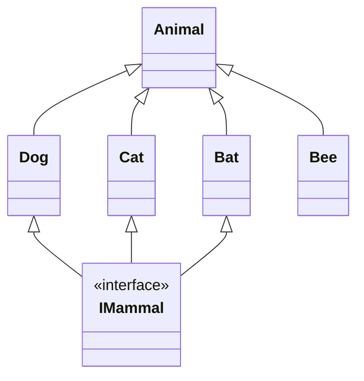

# UML Diagram for AnimalKingdom

```mermaid

classDiagram

    Animal <|-- Dog
    Animal <|-- Cat
    Animal <|-- Bat
    Animal <|-- Bee

    class IMammal
    <<interface>> IMammal
    Dog <|--IMammal
    Cat <|--IMammal
    Bat <|--IMammal


```
