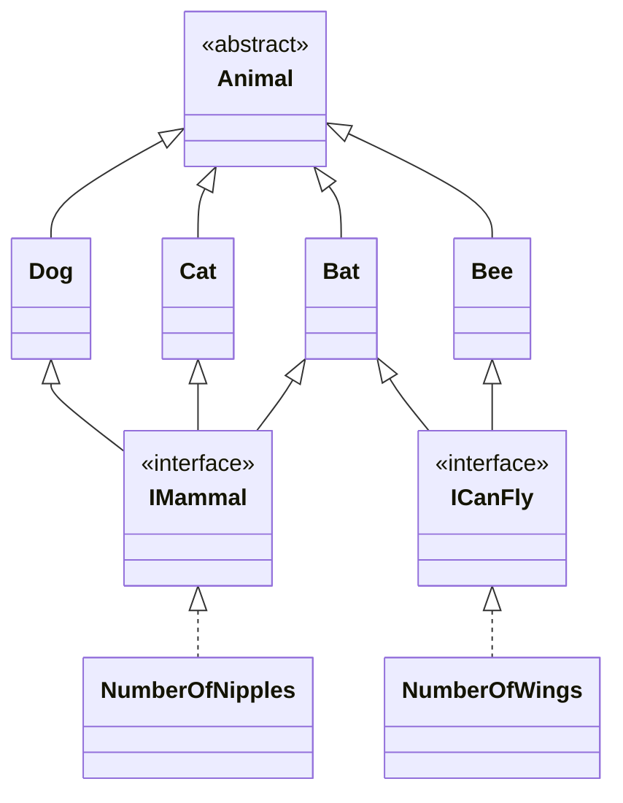

# UML Diagram for AnimalKingdom

```mermaid

classDiagram

    class Animal
    <<abstract>> Animal
    Animal <|-- Dog
    Animal <|-- Cat
    Animal <|-- Bat
    Animal <|-- Bee

    class IMammal
    <<interface>> IMammal
    Dog <|--IMammal
    Cat <|--IMammal
    Bat <|--IMammal

    class ICanFly
    <<interface>> ICanFly
    Bat <|--ICanFly
    Bee <|--ICanFly

    IMammal <|.. NumberOfNipples
    ICanFly <|.. NumberOfWings

```
